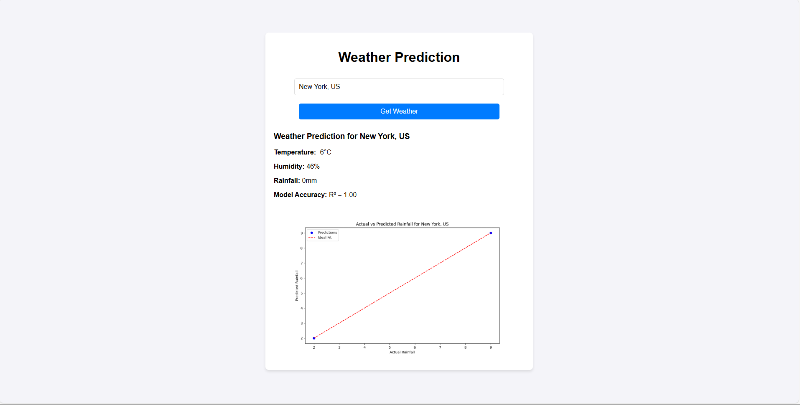
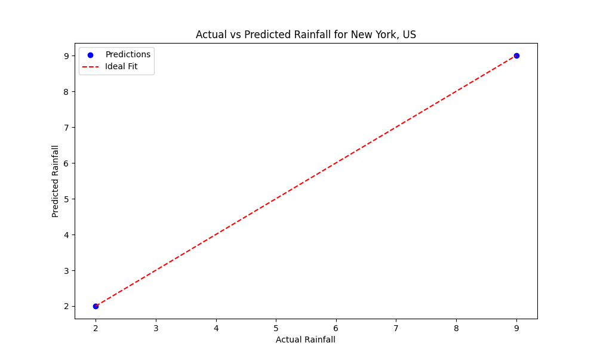

# Weather Prediction Application

This project predicts rainfall based on temperature and humidity using a linear regression model. It integrates the WeatherStack API to fetch real-time weather data for a user-provided location. The results are displayed on a user-friendly web interface.

---

## Features
- Users can enter a location (e.g., "New York, US") to fetch live weather data.
- The app predicts rainfall using machine learning.
- Displays a plot of actual vs predicted rainfall for better insights.
- A responsive frontend allows seamless interaction.


---

## How the Application Works

### User Interface
The app has a clean and interactive frontend where users can input their desired location. Below is an example of the app in action:



### Prediction Results
Once the user enters a location, the app fetches the weather data, performs the prediction, and displays the results along with a rainfall prediction plot.



---

## What I Learned

While working on this project, I developed the following skills:
1. **API Integration**:
   - Learned how to fetch live weather data using the WeatherStack API.
2. **Machine Learning**:
   - Built a linear regression model to predict rainfall based on weather parameters.
   - Evaluated the model using metrics like Mean Squared Error (MSE) and R-squared (R²).
3. **Frontend and Backend Integration**:
   - Developed a Flask-based backend and a responsive HTML/JavaScript frontend.
   - Passed data seamlessly between the frontend and backend.
4. **Data Visualization**:
   - Generated plots using Matplotlib to compare actual vs predicted rainfall.

---

## Setup Instructions

### 1. Clone the Repository
```bash
git clone https://github.com/Swyampatel/weather-prediction-app.git
cd weather_frontend
```

### 2. Install Dependencies
Make sure you have Python installed, then run:
```bash
pip install -r requirements.txt
```

### 3. Add Your WeatherStack API Key
Replace `"YOUR_API_KEY"` in the `app.py` file with your actual API key:
```python
API_KEY = "YOUR_API_KEY"  # Replace this with your WeatherStack API key
```

### 4. Run the Application
Start the Flask server:
```bash
python app.py
```
The application will be available at: `http://127.0.0.1:5000`

---

## Future Enhancements
- Add more weather parameters (e.g., wind speed, cloud cover) to improve prediction accuracy.
- Use a time-series model like LSTM for advanced forecasting.
- Deploy the app on a cloud platform (e.g., AWS, Heroku) for broader accessibility.

---

Feel free to fork this repository and explore the application!
